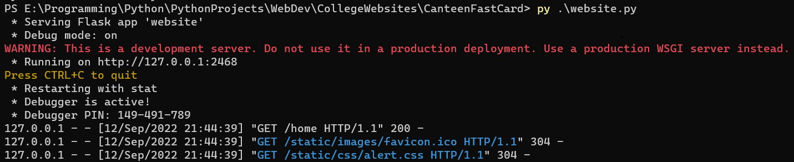
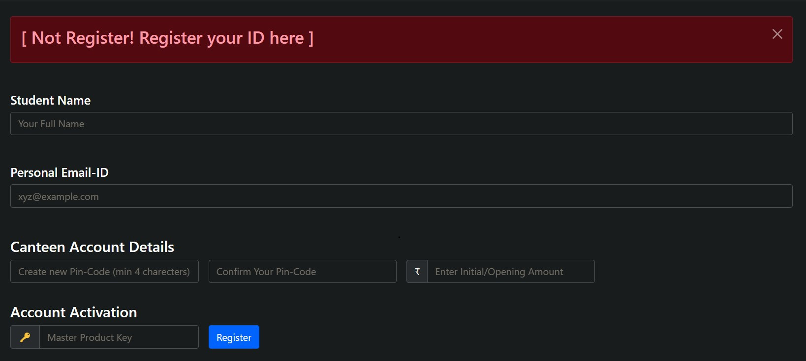
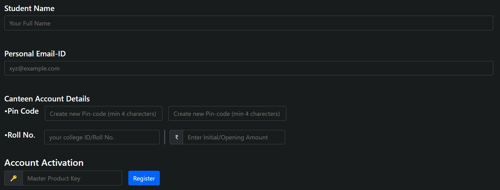
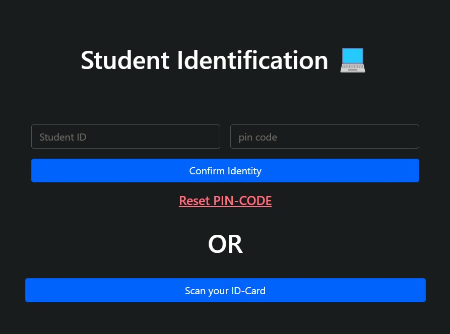
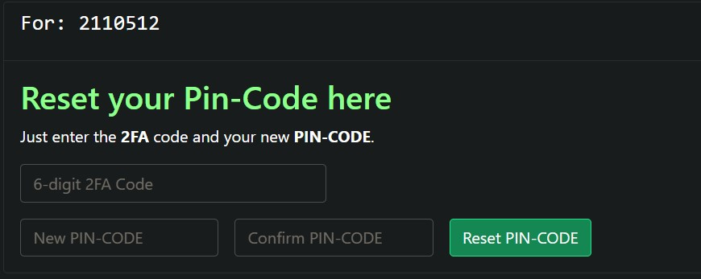
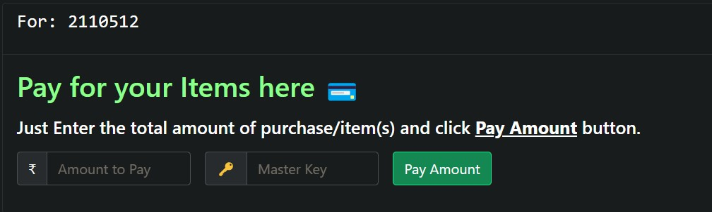
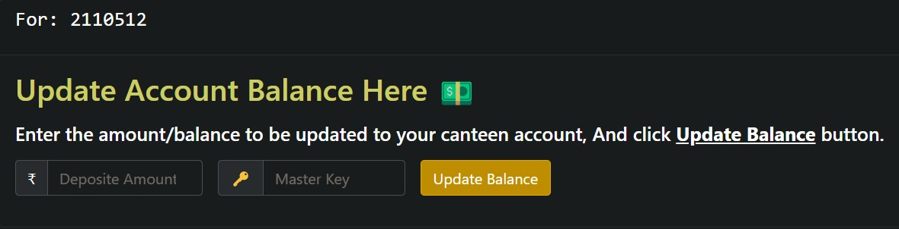
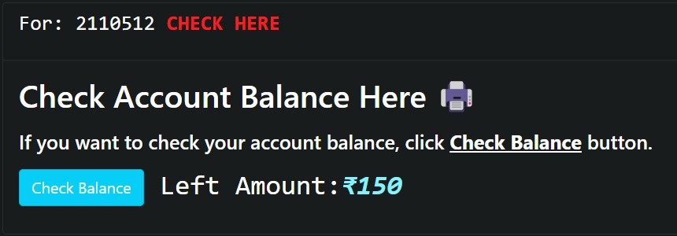
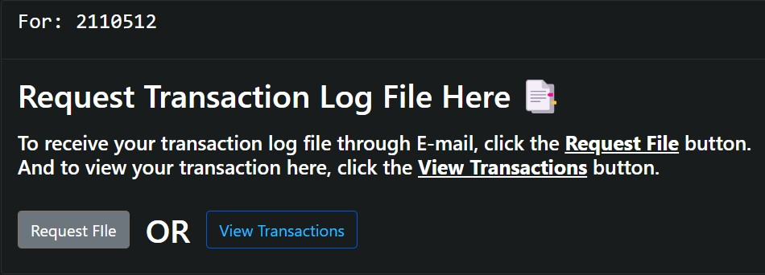

# CanteenFastCard

## <li>About</li>

#### 1. This is a web based (<i>single user</i>) canteen-counter website.

#### 2. This website will help the students to pay for their bought items/products through their college ID card. All you have to do is, scan the <b>college ID card</b> or put your <b>roll no.</b> and <b>pin-code</b>.

#### 3. You just have to create a account on this with a <b><i>initial/starting/activation</i></b> amount. (For Ex.:- ₹50/-)

#### 4. You can also update your account when there's <b><i>low balance</i></b>.

#### 5. You can <b><i>view/check</i></b> their <b><i>current/remaining balance/amount</i></b> of their account by a simple click.

## <li>Preparing the Dir</li>

### 1. Before you start running the website or [`server.py`](https://github.com/bunny-k28/CanteenFastCard/blob/master/server.py) file, you've to prepare your project dir with some files and folders.

### 2. To do so, you'll find a [`setupEnv.py`](https://github.com/bunny-k28/CanteenFastCard/blob/master/setupEnv.py) file in the directory.

### 3. Open your <b><i>CMD/PowerShell/Terminal</i></b> inside the project directory and type 
    • For Win32/64
         py .\setupEnv.py
    
    • For MacOS
        python3 ./server.py

### 4. After the program has finished preparing your directory, you have to make some <i><u>modifications</u></i> in the `website_info.env`.
    • Env Vars
        1. HOST='0.0.0.0'
        2. PORT=2024
        3. DEBUG=True

        4. SMTP_SERVER='smtp.gmail.com'
        5. SERVER_PORT=465

        6. HOST_KEY -> app password of service Email account
        7. HOST_SSID -> service Email account, for sending emails and 2FA codes

        8. MASTER_2FA_EMAIL -> a master email address for admin work
        9. MASTER_PROCESS_KEY -> for registration verification process

### 5. After all these operations, your program is ready to run. Just open your <b><i>CMD/PowerShell/Terminal</i></b> inside the project directory and type
    • For Win32/64
         py .\setupEnv.py
    
    • For MacOS
        python3 ./server.py

 

## <li>Getting Started</li>

### 1. Register

#### [ There are 2 ways to register your ID card. One <u>automatic</u>, one <u>manual</u>. ]

#### 1.1. In auto mode, when you'll scan your <b><i>ID card</i></b> or put your credentials manually. The website will automatically open the  <b><i>registration</i></b> form if the ID is <u><b>not registared</b></u>. After you'll fill up your details in the registration form, the canteen employee will enter the <b><i>Master Key</i></b> as per the verification process. Then you can click the `Register` button to register.

 

#### 1.3. In the manual mode, you have to manually register yourself by clicking on the `Register` button present in <u><b>the top right corner</b></u>. After you'll fill up your details in the registration form, the canteen employee will enter the <b><i>Master Key</i></b> as per the verification process. Then you can click the `Register` button to register.

 

### 2. Login

#### [ There are two ways to login to your account. One by <b>scanning ID-card</b>, one by entering <b>roll no.</b> and <b>password/pin-code</b>. ]

#### 2.1. One way to login is, by scanning your college ID card. Click the `scan your ID-Card` button. Place your ID card in front of the webcam and there you are. You'll be logged-in.

#### 2.2. Another way to login is, bu entering your roll no. and your login-pin-code. After entering your credentials just click the `confirm identity` button, and there you are. You'll be logged-in.

### 3. Password/Pin-Code Reset

#### [ There are 2 ways to <b>reset</b> your <b><i>account password/pin-code</i></b>. One by <b><i>reset link</i></b>, one by <i><b>posting request</i></b>. ]

#### 3.1. On the <b>login page</b>, you'll see a <b><i><u>reset link in red</u></i></b>. The link will take you to the <b>reset password/pin-code form</b>. Before filling up the reset form, you have to <b><i>verify your Identity 1st</i></b>. Then you'll fill-up the <b>required fields</b> and that will reset your <b><i>password/pin-code</i></b>.

#### 3.2. Another way is by <b>posting</b> a password/pin-code <b>reset request</b> to the admin(s) on the <u><b><i><a href="https://discord.gg/QqkD5n6Z/c2wEPdhD5J">discord server channel</a></i></b></u> or <b>posting a reset request</b> through this <b>E-mail</b>:- <u><b><i>bot.kiit.kp.canteen@gmail.com</i></b></u>. Just send your:-
    1. Roll Number
    2. USID
    3. New Password/Pin-code

## <li>How to use (~the dashboard)</li>

#### [ Once you've logged-in, you'll be in your CanteenFastCard dashboard from where you can pay for your items, check your account balance, put more amount into your account and you can also view/request your transaction(s) log file (or receipt). ]

### 1. Payment

#### As you can see in the above image, you just have to enter the <b>total amount</b> of the bought item(S) and then the canteen employee will enter the your pin code as per the verification process. Then click the `Pay Amount` button.
 

### 2. Update

#### As you can see in the above image, you just have to enter the amount you want to update/deposite into your account and then the canteen employee will enter the your pin code as per the verification process. Then click the `Update Balance` button.
 

### 3. Check

#### As you can see in the above image, you just have to click the `Check Balance` button and you'll be able to check your <i><u>current account balance</u></i>.
 

### 4. Log

#### As you can see in the above image, there are 2 buttons. One, the `View Transition` button to view the <i><u>transaction history/log</u></i> in the browser. Second, the `Request File` button, this request button will <i><u>mail you a softcopy</u></i>  of your transaction history/log.
 
